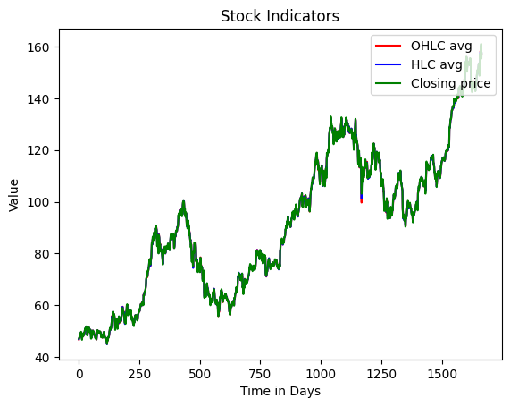
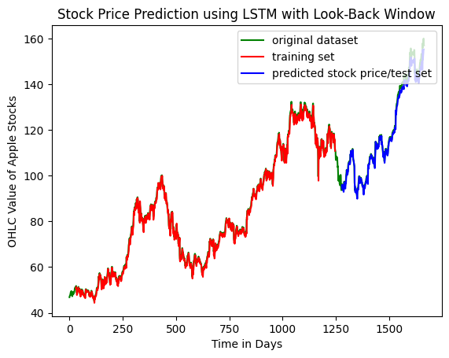
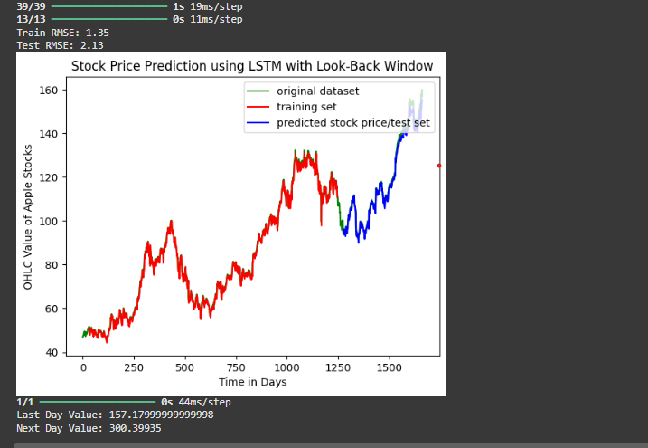

# Stock Price Prediction using LSTM

This repository contains a Python script that uses a Long Short-Term Memory (LSTM) neural network to predict future stock prices based on historical data. The model is built using Keras and TensorFlow.

## Results

Below are the plots generated by the script, visualizing the different stages of the stock price prediction model.

### 1. Indicators Comparison
This plot shows the different price indicators (OHLC average, HLC average, and Closing price) used in the analysis.



### 2. Model Performance
This plot displays the original dataset alongside the predictions made by the LSTM model on both the training and test sets.



### 3. Future Prediction
This plot shows the prediction for the next day's stock price based on the historical data.




## Key Features

- **Time-Series Forecasting:** The project uses a multi-step time-series approach with a `look_back` window to capture temporal dependencies in the data.
- **Data Preprocessing:** It includes a custom preprocessing script (`preprocessing.py`) to prepare the data for the LSTM model, including min-max scaling and sequence creation.
- **Model Architecture:** The model consists of two LSTM layers and a final dense layer for regression, optimized with the Adam optimizer.
- **Performance Evaluation:** Model performance is evaluated using the Root Mean Squared Error (RMSE) on both the training and test sets.

## Files in this Repository

- `StockPrediction.py`: The main script that loads the data, builds and trains the LSTM model, and visualizes the results.
- `preprocessing.py`: A utility script containing the `new_dataset` function, which is essential for creating the time-series sequences for the LSTM.
- `apple_share_price.csv`: The dataset used for training and testing the model.

## How to Run the Code

1.  **Clone the repository:**
    ```bash
    git clone [https://github.com/KarthikJoshi11/Stock_Prediction_LSTM.git](https://github.com/KarthikJoshi11/Stock_Prediction_LSTM.git)
    cd Stock_Prediction_LSTM
    ```

2.  **Install the required libraries:**
    It is highly recommended to use a virtual environment to avoid dependency conflicts.
    ```bash
    # Create a virtual environment
    python3 -m venv venv

    # Activate the virtual environment
    source venv/bin/activate  # On Windows, use `venv\Scripts\activate`

    # Install the necessary packages
    pip install pandas numpy scikit-learn matplotlib keras tensorflow
    ```

3.  **Run the script:**
    ```bash
    python StockPrediction.py
    ```
    This will execute the code, train the model, and display the performance metrics and a plot of the results.
